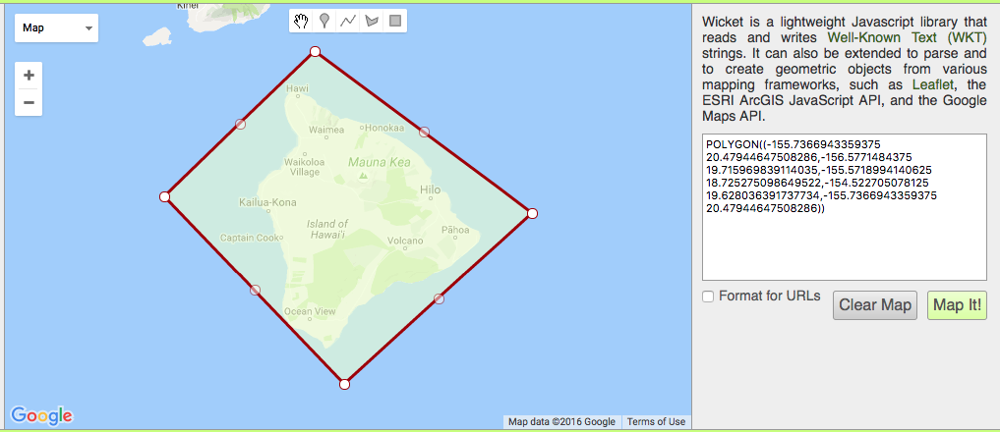

# S2 testing

## About
I am looking to use the S2 library to hold Open Core Data spatial data.  Since all my data is 
just point data and there are only a few tens of thousands at most, this is not a very large db.

Also, all queries are just either circles, rectanles or rather simple polys.  So supporting the whole
range of use cases is not that complex.

However, I am having issues getting the searches to return the kind of results I am expecting.  Even when I 
go to very large grid counts it seems I am getting returns that are outside of my spatial request.  

The polygon in use is:

with various point locations around the islands used to test if they should be inside or outside the 
searches.  

The current code is all self contained and relies only on S2, GeoJSON and BoltDB libraries. 

## Refs
There are several good blog posts about using S2. These are ones I am trying to use to get some 
working code examples.

* http://blog.nobugware.com/post/2016/geo_db_s2_geohash_database/ 
* http://blog.christianperone.com/2015/08/googles-s2-geometry-on-the-sphere-cells-and-hilbert-curve/

Look for help
* https://github.com/golang/geo/issues/14#issuecomment-257155616
* https://github.com/golang/geo/pull/6 
* https://github.com/golang/geo/blob/master/s2/point.go#L85 