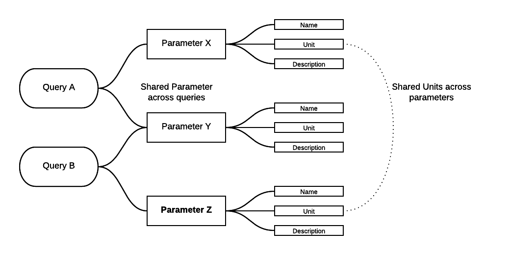

### JanusCSV2Graph  
##### A test to build a graph of Janus data types, units, query and measurement descriptions.  

#### Intro

This member of the garden is a test to see what I could do with the collection of .txt files in here.  These files are really CSV (tab separated) files created by Pat Diver that expose metadata on the DSDP/ODP/IODP Janus database.  They are

* **`ocd_metadata.txt`**  
A master file that contains most of the metadata associated with Janus.  There are some extra elements in the various other files below but a lot of overlap. 
* **`ocd_metadata_hdr.txt`** 
A file that defines out some of the various query views into the Janus database like: JanusChemCarb.  It then also provides a brief description of these views.  
* **`ocd_metadata_json_skos.txt`**  
A file that associates a set or terms (parameters) with their units and also a brief description string.  This file could easily help populate a simple SKOS based vocabulary, hence its name
* **`ocd_metadata_units.txt`**   
A description of UNITS used in various Janus columns/parameters

#### Output process
The main.go code in here is a simple program that reads and parses the CSV and then makes an initial RDF file.  This test.nt file is a N-triples representation of the data.  A few things to note:

* This .nt file does not use any vocabularies like NCEAS /oboe (https://github.com/NCEAS/oboe) or others at this time.  That is part of what this effort is about, to get an idea of what I should be using to encode this.
* I likely should look at QUDT (http://www.qudt.org/) but I tried once and it hurt.   Jokes aside, I can't
even tell if I should be looking at this.
* Also should review ODM2 (http://www.odm2.org/) and see what I could use there.
* Several vocabulary elements in test.nt are made up and are not resolvable URI's.  It's a test after all and I really want to use existing things in the end, not make something up.  For now I am just doing this to allow me to build out a graph to share to enable discussion with others.  

The **test.nt** file is here to look at, but it's N-triples are noted so not the easiest to review.  I need to set up some live queries that people can follow and look at.  The main queries and results will be something like:

* A simple query like q1 below that returns all the columns, parameter names, units,  and description to be added to the landing page for the datasets.  An example of the results (not all of them) are below for 2 or 3 of the columns for that call.
* Also want to be able to have people select a parameter and see all datasets that have data for it
* Also should be able to request all datasets for a given measurement


The basic goal is to allow a relation between queries, parameters and units.  Note, I need to try and be clear on what each of these mean to me.  I am not sure there is a common agreement on what each is but I should try and find one and use it.   The goal is to allow people to walk across various datasets and also aid in the discovery of datasets based on these items and their relationship.



#### Notes and comments

Some SPARQL call examples on the resulting graph:

q1

```
SELECT  DISTINCT *  
WHERE {
  ?uri <http://example.org/rdf/type> <http://opencoredata.org/id/voc/janus/v1/JanusQuerySet> .
  ?uri     <http://opencoredata.org/id/voc/janus/v1/struct_name> "janusageprofile" .
  ?uri ?p ?o .
}
```

Results with a 24 limit..  (will provide live SPARQL links when I get the graph deployed):

```
uri	p	o
<http://opencoredata/id/resource/janus/janusageprofile/1>	<http://example.org/rdf/type>	<http://opencoredata.org/id/voc/janus/v1/JanusQuerySet>
<http://opencoredata/id/resource/janus/janusageprofile/1>	<http://opencoredata.org/id/voc/janus/v1/column_id>	1
<http://opencoredata/id/resource/janus/janusageprofile/1>	<http://opencoredata.org/id/voc/janus/v1/column_name>	LEG
<http://opencoredata/id/resource/janus/janusageprofile/1>	<http://opencoredata.org/id/voc/janus/v1/go_struct_name>	Leg
<http://opencoredata/id/resource/janus/janusageprofile/1>	<http://opencoredata.org/id/voc/janus/v1/go_struct_type>	int64
<http://opencoredata/id/resource/janus/janusageprofile/1>	<http://opencoredata.org/id/voc/janus/v1/JanusMeasurement>	<http://opencoredata/id/resource/janus/measure/leg>
<http://opencoredata/id/resource/janus/janusageprofile/1>	<http://opencoredata.org/id/voc/janus/v1/struct_name>	janusageprofile
<http://opencoredata/id/resource/janus/janusageprofile/1>	<http://opencoredata.org/id/voc/janus/v1/table_name>	<http://opencoredata/id/resource/janus/query/ocd_age_profile>
<http://opencoredata/id/resource/janus/janusageprofile/10>	<http://example.org/rdf/type>	<http://opencoredata.org/id/voc/janus/v1/JanusQuerySet>
<http://opencoredata/id/resource/janus/janusageprofile/10>	<http://opencoredata.org/id/voc/janus/v1/column_id>	10
<http://opencoredata/id/resource/janus/janusageprofile/10>	<http://opencoredata.org/id/voc/janus/v1/column_name>	DATUM_ID
<http://opencoredata/id/resource/janus/janusageprofile/10>	<http://opencoredata.org/id/voc/janus/v1/go_struct_name>	Datum_id
<http://opencoredata/id/resource/janus/janusageprofile/10>	<http://opencoredata.org/id/voc/janus/v1/go_struct_type>	int64
<http://opencoredata/id/resource/janus/janusageprofile/10>	<http://opencoredata.org/id/voc/janus/v1/JanusMeasurement>	<http://opencoredata/id/resource/janus/measure/datum_id>
<http://opencoredata/id/resource/janus/janusageprofile/10>	<http://opencoredata.org/id/voc/janus/v1/struct_name>	janusageprofile
<http://opencoredata/id/resource/janus/janusageprofile/10>	<http://opencoredata.org/id/voc/janus/v1/table_name>	<http://opencoredata/id/resource/janus/query/ocd_age_profile>
<http://opencoredata/id/resource/janus/janusageprofile/11>	<http://example.org/rdf/type>	<http://opencoredata.org/id/voc/janus/v1/JanusQuerySet>
<http://opencoredata/id/resource/janus/janusageprofile/11>	<http://opencoredata.org/id/voc/janus/v1/column_name>	DATUM_TYPE
<http://opencoredata/id/resource/janus/janusageprofile/11>	<http://opencoredata.org/id/voc/janus/v1/go_struct_name>	Datum_type
<http://opencoredata/id/resource/janus/janusageprofile/11>	<http://opencoredata.org/id/voc/janus/v1/go_struct_type>	string
<http://opencoredata/id/resource/janus/janusageprofile/11>	<http://opencoredata.org/id/voc/janus/v1/JanusMeasurement>	<http://opencoredata/id/resource/janus/measure/datum_type>
<http://opencoredata/id/resource/janus/janusageprofile/11>	<http://opencoredata.org/id/voc/janus/v1/struct_name>	janusageprofile
<http://opencoredata/id/resource/janus/janusageprofile/11>	<http://opencoredata.org/id/voc/janus/v1/table_name>	<http://opencoredata/id/resource/janus/query/ocd_age_profile>
<http://opencoredata/id/resource/janus/janusageprofile/12>	<http://example.org/rdf/type>	<http://opencoredata.org/id/voc/janus/v1/JanusQuerySet>
```


Some other queries I am holding here for potential documentation.

q2

```
prefix bds: <http://www.bigdata.com/rdf/search#>
select DISTINCT *
where {
   ?o bds:search "janustensorcore" .
   ?s ?p ?o .
   ?s ?pp ?oo .
}
```

q3

```
prefix bds: <http://www.bigdata.com/rdf/search#>
select DISTINCT ?tn
where {
   ?o bds:search "janustensorcore" .
   ?s ?p ?o .
   ?s <http://opencoredata.org/id/voc/janus/v1/table_name>  ?tn
}
```

q4

```
prefix bds: <http://www.bigdata.com/rdf/search#>
select ?s ?p ?o
where {
   ?o bds:search "janustensorcore" .
   ?s ?p ?o .
}
```

q5

```
SELECT  *
WHERE {
  ?uri <http://example.org/rdf/type> <http://opencoredata.org/id/voc/janus/v1/JanusQuerySet> .
  ?uri     <http://opencoredata.org/id/voc/janus/v1/struct_name> "janusageprofile" .
  ?uri <http://opencoredata.org/id/voc/janus/v1/JanusMeasurement> ?jm .
  ?jm   ?p ?o
}
```

q6

```
SELECT  *
WHERE {
  ?col  <http://opencoredata.org/id/voc/janus/v1/JanusMeasurement> <http://opencoredata/id/resource/janus/measure/datum_age> .
  ?col  <http://opencoredata.org/id/voc/janus/v1/table_name>  ?hdr .
  ?hdr ?p ?o  .   
}
```